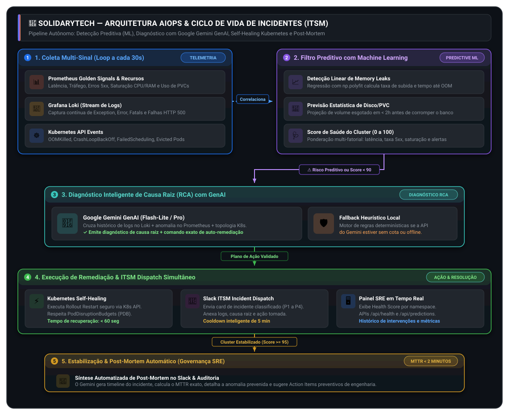
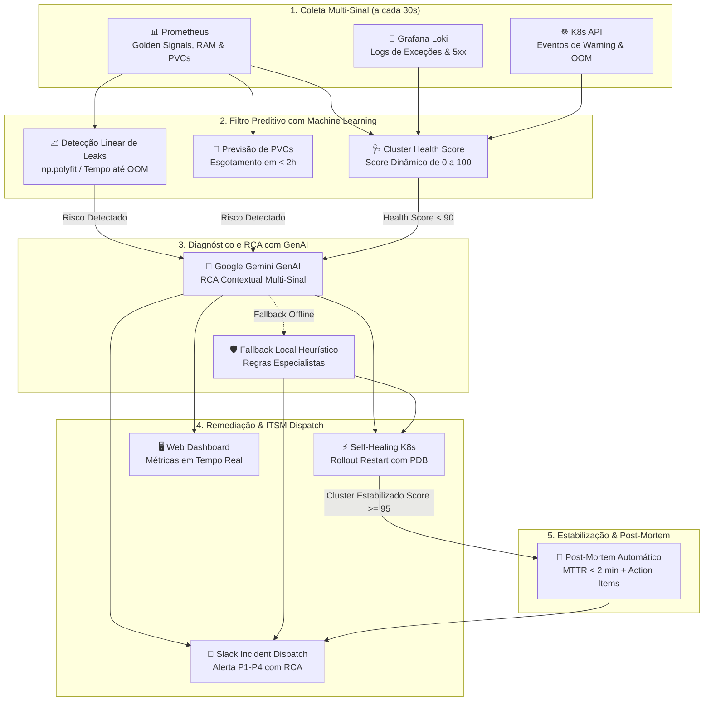

# 🧠 AIOps Predictive Engine & Autonomous Self-Healing

> **Plataforma SolidaryTech — Hackathon Tech Challenge (Fase 5)**  
> **Especialização em Cloud & DevOps / SRE — FIAP**  
> **Atendimento Direto ao Requisito 3:** *ITSM e AIOps: Gestão Preditiva de Incidentes*

O **AIOps Predictive Engine** é o cérebro operacional e de auto-remediação (*Autonomous Self-Healing*) da plataforma **SolidaryTech**. Ele atua como um engenheiro autônomo de Site Reliability Engineering (SRE), integrando telemetria em tempo real, detecção preditiva de anomalias com Machine Learning, diagnóstico inteligente de causa raiz (RCA) com **Google Gemini GenAI**, execução de ações seguras no Kubernetes e emissão automatizada de relatórios de **Post-Mortem** no Slack.

> [!NOTE]
> Para detalhes completos sobre a governança de SLA, SLI, SLO, Error Budget e arquitetura de Disaster Recovery Multi-Região, consulte a documentação oficial:
> * 📊 [README_postmortem.md](README_postmortem.md) — Engenharia de Confiabilidade (SRE) e Governança de SLOs
> * 🛡️ [PCN_PLANO_CONTINUIDADE_NEGOCIOS.md](PCN_PLANO_CONTINUIDADE_NEGOCIOS.md) — Plano de Continuidade de Negócios (RTO e RPO)
> * 💰 [FINOPS_FORECAST_CUSTOS.md](FINOPS_FORECAST_CUSTOS.md) — Gestão Financeira e Forecast FinOps
> * 🎓 [RELATORIO_FINAL_HACKATHON.md](RELATORIO_FINAL_HACKATHON.md) — Relatório Executivo de Entrega da Fase 5

---

## 🔄 Arquitetura do Motor & Ciclo de Vida de Incidentes (ITSM)

O motor executa um loop assíncrono contínuo a cada **30 segundos** (configurável via `ANALYSIS_INTERVAL_SECONDS`), correlacionando métricas, logs e eventos de infraestrutura:

<div align="center">
  
  <p><em>Figura 1: Arquitetura completa de telemetria multi-sinal, inferência preditiva com Machine Learning, diagnóstico GenAI (Google Gemini), self-healing no Kubernetes e fechamento com Post-Mortem.</em></p>
</div>

<details>
<summary>🔍 <b>Clique para visualizar a especificação técnica do fluxo (Mermaid Diagram)</b></summary>



</details>

---

## 📋 Ciclo de Vida de Incidentes ITSM (Da Detecção ao Post-Mortem)

Em conformidade estrita com o **Requisito 3 do Hackathon**, o fluxo operacional de incidentes da SolidaryTech é automatizado de ponta a ponta:

| Fase ITSM | Gatilho / Origem | Ação do AIOps Engine | SLA / Tempo Médio |
| :--- | :--- | :--- | :--- |
| **1. Detecção Preditiva** | Prometheus, Loki ou K8s Events | Regressão linear detecta tendência de OOMKill antes do Pod travar. | **< 30 segundos** |
| **2. Triagem e Alerta** | Anomalia confirmada pelo ML | Envio de card de alerta enriquecido para o canal do Slack com classificação de severidade (`P1` a `P4`). | **Instantâneo** |
| **3. Diagnóstico (RCA)** | Disparo automático no Gemini | Análise contextual dos logs recentes do Loki e métricas do Prometheus para identificar a causa raiz. | **3 a 5 segundos** |
| **4. Auto-Remediação** | `AUTO_HEALING_ENABLED=true` | Rollout restart gracioso do deployment afetado com respeito a PodDisruptionBudgets (PDB). | **< 60 segundos** |
| **5. Estabilização** | Health Score $\ge 95$ | Validação contínua do cluster sem erros residuais por 2 ciclos consecutivos. | **1 a 2 minutos** |
| **6. Post-Mortem** | Cluster recuperado | O Gemini sintetiza o relatório de Post-Mortem com timeline, MTTR calculado e itens de ação preventivos. | **Automático** |

> [!TIP]
> **Redução Ativa do MTTR (Mean Time to Recovery):**  
> Em uma operação tradicional, a triagem manual, análise de logs e reinicialização de pods levam tipicamente de **15 a 30 minutos**. O AIOps Engine reduz o MTTR para **menos de 2 minutos**, atuando antes mesmo da indisponibilidade ser percebida pelo doador.

---

## 🤖 Modelos Gemini Suportados & Compatibilidade

O AIOps Engine possui **descoberta dinâmica de modelos** com fallback inteligente para garantir operação 100% contínua:

| Modelo | Status | Finalidade | Cota Free Tier (Google AI Studio) |
| :--- | :--- | :--- | :--- |
| **`gemini-3.6-flash-lite`** | ⭐ **Recomendado** | Altíssima velocidade, baixíssima latência e excelente raciocínio SRE | 15 RPM Gratuitas |
| **`gemini-3.6-flash`** | Ativo | Análises profundas de correlação de logs extensos e traces | 15 RPM Gratuitas |
| **`gemini-3.5-flash-lite`** | Ativo | Modelo leve e econômico para microdiagnósticos | 15 RPM Gratuitas |
| **`gemini-3.1-pro-preview`** | Compatível | Análises arquiteturais complexas e síntese executiva | Disponível |

---

## 🛡️ Políticas de Remediação Segura & Guardrails

Para garantir a estabilidade do cluster e evitar efeitos colaterais destrutivos, o AIOps implementa 4 guardrails fundamentais:

1. **Modo Shadow / Dry-Run (`AUTO_HEALING_ENABLED=false`)**:
   - Por padrão, o motor analisa, gera o diagnóstico de causa raiz e envia alertas no Slack **sem aplicar alterações no Kubernetes**, permitindo auditoria humana inicial.
2. **Rate Limiting & Anti-Flapping**:
   - Limite estrito de no máximo **2 reinicializações por serviço em uma janela de 30 minutos**, impedindo loops de reinicialização (*flapping*).
3. **Respeito aos Pod Disruption Budgets (PDB)**:
   - As reinicializações utilizam a API de Rollout do Kubernetes (`kubectl rollout restart`), garantindo que o número mínimo de réplicas saudáveis permaneça ativo durante a intervenção.
4. **Resiliência com Fallback Determinístico Local**:
   - Caso a API externa do Google Gemini fique indisponível (limite de quota temporário ou falha de conectividade), o módulo **`_expert_rulebook_rca`** assume o diagnóstico localmente através de heurísticas determinísticas, mantendo o auto-healing 100% operacional.

---

## 🔑 Como Obter a Chave Gratuita do Google Gemini (Free Tier)

Para utilizar o Gemini de forma **100% gratuita (sem necessidade de cartão de crédito)**:

1. Acesse o portal **[Google AI Studio - API Keys](https://aistudio.google.com/app/apikey)**.
2. Faça login com sua conta Google.
3. Clique em **"Create API key"**.
4. ⚠️ **IMPORTANTE:** Selecione **"Create API key in new project"** (Criar chave em um novo projeto). Isso garante vinculação ao **Free Tier padrão (15 RPM gratuitas)**.
5. Copie a chave gerada (inicia com `AIzaSy...`).

---

## 🐳 Como Executar Localmente via Docker

### 1. Build da Imagem
```bash
docker build -t aiops-engine apps/aiops-engine
```

### 2. Execução do Contêiner
```bash
docker run -d --name aiops-engine-test   -p 8000:8000   -e GEMINI_API_KEY="AIzaSySuaChaveAqui"   -e GEMINI_MODEL="gemini-3.6-flash-lite"   -e AUTO_HEALING_ENABLED="true"   -e SLACK_WEBHOOK_URL="https://hooks.slack.com/services/..."   aiops-engine
```

---

## 🧪 Testes de Caos & Simulação de Anomalias

O AIOps Engine expõe endpoints dedicados para injeção de falhas sintéticas, permitindo validar a inteligência artificial ao vivo:

### Simulação 1: Memory Leak (Prevenção de OOMKilled)
Injeta uma taxa de consumo de memória progressiva para testar a regressão linear e o cálculo de tempo até OOM:
```bash
curl -X POST http://localhost:8000/api/simulate-anomaly   -H "Content-Type: application/json"   -d '{"scenario": "memory_leak"}' | jq .
```

### Simulação 2: Surto de Erros HTTP 5xx (Golden Metric)
Injeta uma taxa de falhas HTTP 500 no caminho crítico de doações para testar o diagnóstico de causa raiz:
```bash
curl -X POST http://localhost:8000/api/simulate-anomaly   -H "Content-Type: application/json"   -d '{"scenario": "5xx_surge"}' | jq .
```

### Consultar os Diagnósticos Gerados pela IA
```bash
curl -s http://localhost:8000/api/insights | jq .
```

---

## 🖥️ Dashboard Web Interativo

Acesse no navegador: **[http://localhost:8000](http://localhost:8000)**

### Recursos da Interface:
* **Cluster Health Index**: Indicador circular com pontuação dinâmica de 0 a 100 baseado na gravidade dos incidentes.
* **Cards de Diagnóstico Gemini GenAI**: Exibição estruturada de Causa Raiz, Impacto, Comando Sugerido e Playbook de Resolução.
* **Painel de Simulação de Caos**: Botões interativos para disparar falhas sintéticas em 1 clique durante apresentações.
* **Log Stream do Loki**: Visualização em tempo real das mensagens de erro extraídas do cluster.

---

## 🔌 Endpoints da API REST

| Método | Rota | Descrição |
| :--- | :--- | :--- |
| `GET` | `/` | Retorna o Dashboard Web interativo. |
| `GET` | `/live` | Liveness Probe r?pida do Kubernetes (processo uvicorn/FastAPI). |
| `GET` | `/ready` | Readiness Probe de telemetria (valida conectividade com Loki, Prometheus e K8s). |
| `GET` | `/health` | Health Check mantido para compatibilidade com GKE Load Balancers. |
| `GET` | `/api/connectivity-test` | Auditoria completa de conectividade e lat?ncia dos backends (Loki, Prom, K8s, Gemini, Slack). |
| `GET` | `/api/post-mortems` | Hist?rico de relat?rios oficiais de Post-Mortem SRE gerados com MTTR e RCA. |
| `GET` | `/api/status` | Retorna o payload completo de telemetria e estado operacional. |
| `GET` | `/api/health-score` | Retorna a pontuação de saúde consolidada do cluster (0 a 100). |
| `GET` | `/api/predictions` | Lista previsões ativas de esgotamento de memória e PVCs. |
| `GET` | `/api/anomalies` | Lista anomalias de latência e taxa de erro detectadas. |
| `GET` | `/api/insights` | Retorna os diagnósticos de Causa Raiz (RCA) gerados pelo Gemini. |
| `POST` | `/api/simulate-anomaly` | Dispara cenários de caos sintéticos (`memory_leak`, `5xx_surge`). |
| `POST` | `/api/analyze-now` | Força a execução imediata de um ciclo de análise completo. |
| `POST` | `/api/remediate/{id}` | Dispara manualmente a remediação de um risco específico. |

---

## ⚙️ Variáveis de Ambiente

| Variável | Padrão | Descrição |
| :--- | :--- | :--- |
| `GEMINI_API_KEY` | `""` | Chave de API do Google Gemini (Google AI Studio). |
| `GEMINI_MODEL` | `gemini-3.6-flash-lite` | Modelo do Gemini utilizado para análise de RCA e Post-Mortem. |
| `ANALYSIS_INTERVAL_SECONDS` | `30` | Intervalo em segundos entre ciclos de coleta e análise em background. |
| `AUTO_HEALING_ENABLED` | `false` | Se `true`, autoriza ações autônomas de reinicialização e auto-cura no cluster. |
| `PROMETHEUS_URL` | `http://monitoring-kube-prometheus-prometheus.monitoring-ns.svc.cluster.local:9090` | Endpoint do Prometheus no cluster GKE. |
| `LOKI_URL` | `http://loki.monitoring-ns.svc.cluster.local:3100` | Endpoint do Loki no cluster GKE. |
| `TARGET_NAMESPACES` | `donation-ns,ngo-ns,volunteer-ns,monitoring-ns,kubecost` | Namespaces monitorados ativamente pelo motor. |
| `SLACK_WEBHOOK_URL` | `""` | URL do Webhook do Slack para alertas de incidentes e envio de Post-Mortem. |
| `SLACK_ALERT_COOLDOWN_SECONDS` | `300` | Tempo mínimo de espera (5 min) entre alertas repetidos do mesmo Pod. |
| `AIOPS_LANGUAGE` | `pt-BR` | Idioma utilizado para os relatórios, alertas e diagnósticos gerados. |

---

## 🎯 Alinhamento com a Avaliação do Tech Challenge (Fase 5)

| Requisito do PDF | Implementação no AIOps Engine | Evidência Comprovada |
| :--- | :--- | :--- |
| **AIOps Preditivo** | Detecção de Memory Leaks e PVCs via Machine Learning antes do impacto. | `core/predictor.py` + Endpoint `/api/predictions` |
| **GenAI RCA** | Diagnóstico inteligente de causa raiz contextualizado via Google Gemini. | `core/ai_reasoner.py` + Endpoint `/api/insights` |
| **Ciclo ITSM** | Desenho do ciclo de vida de incidentes com Post-Mortem automático no Slack. | Diagrama Mermaid + Envio automático ao estabilizar |
| **Redução de MTTR** | Auto-cura autônoma via Kubernetes API reduzindo recuperação para $< 2$ min. | `core/remediator.py` + Rollout Restart |
| **Governança SRE** | Monitoramento das 4 Golden Signals do Google e correlação com Loki. | `core/prometheus_client.py` + `core/loki_client.py` |
