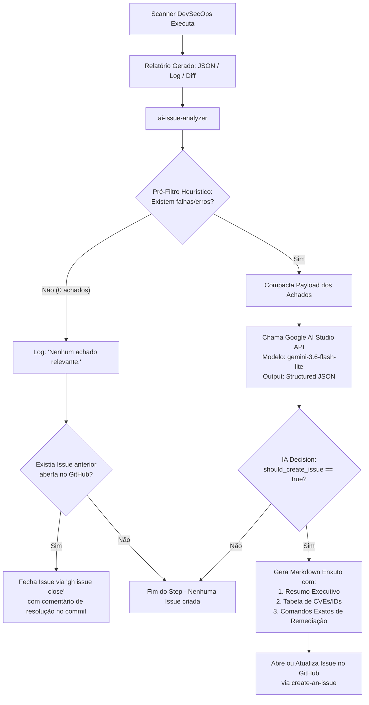

# 🤖 CI/CD, DevSecOps & Automações com GitHub Actions e IA

Esta documentação detalha a arquitetura completa dos fluxos de trabalho (**Workflows**) do GitHub Actions do projeto **SolidaryTech**. A esteira implementa governança de qualidade de código, segurança contínua (**DevSecOps**), compilação de imagens OCI, sincronização **GitOps** com Argo CD, replicação para **Disaster Recovery (DR)** e um inovador **Motor de Triagem e Remediação de Segurança com Google AI Studio (Gemini)**.

---

## 🗺️ Mapa Completo da Esteira

```text
┌──────────────────────────────────────────────────────────────────────────────────────────────────────────┐
│                                ESTEIRA DE CI/CD, DEVSECOPS & IA (GITHUB ACTIONS)                         │
├──────────────────────────────────────────────────────────────────────────────────────────────────────────┤
│                                                                                                          │
│  [ Git Push / Pull Request em main ]                                                                     │
│               │                                                                                          │
│               ▼                                                                                          │
│  ┌────────────────────────────────────────────────────────────────────────────────────────────────────┐  │
│  │ 1. QUALIDADE DE CÓDIGO (LINT COM AUTO-CORREÇÃO)                                                    │  │
│  │    ├── reusable-lint.yaml                                                                          │  │
│  │    │   ├── Go: gofmt + golangci-lint (--fix) ➔ auto-commit e push para main                        │  │
│  │    │   └── Python: black + isort + flake8 + pylint ➔ auto-commit e push para main                  │  │
│  │    └── tf-lint.yaml ➔ Validação de infraestrutura Terraform (fmt, validate, tflint)               │  │
│  └──────────────────────────────────────────────┬─────────────────────────────────────────────────────┘  │
│                                                 │                                                        │
│                                                 ▼                                                        │
│  ┌────────────────────────────────────────────────────────────────────────────────────────────────────┐  │
│  │ 2. DEVSECOPS MULTI-CAMADA (SAST, SCA, SECRETS & CONTAINER)                                         │  │
│  │    ├── reusable-sast.yaml                                                                          │  │
│  │    │   ├── Go: Gosec (Análise estática de vulnerabilidades Go)                                     │  │
│  │    │   ├── Python: Bandit (Análise estática de vulnerabilidades Python)                            │  │
│  │    │   └── Trivy Secrets: Detecção de credenciais/tokens hardcoded no repositório                  │  │
│  │    ├── reusable-sca.yaml                                                                           │  │
│  │    │   ├── Trivy FS: Varredura de CVEs em dependências (go.mod, requirements.txt)                  │  │
│  │    │   └── OWASP Dependency-Check: Validação cruzada com base NVD (CVSS >= 9)                     │  │
│  │    └── reusable-container-scan.yaml                                                                │  │
│  │        ├── Dockerfile: Trivy Config (Detecção de misconfigurations e conformidade CIS)            │  │
│  │        └── Imagem OCI: Trivy Image (Vulnerabilidades em pacotes e camadas da imagem)               │  │
│  └──────────────────────────────────────────────┬─────────────────────────────────────────────────────┘  │
│                                                 │                                                        │
│                                                 ▼                                                        │
│  ┌────────────────────────────────────────────────────────────────────────────────────────────────────┐  │
│  │ 3. MOTOR DE TRIAGEM INTELIGENTE COM IA (.github/actions/ai-issue-analyzer)                         │  │
│  │    ├── Pré-filtro Heurístico (Custo Zero de API): Se 0 achados ➔ nenhuma issue aberta             │  │
│  │    ├── Auto-Close: Se o commit corrigiu a falha anterior ➔ fecha a issue aberta via gh CLI        │  │
│  │    ├── Análise GenAI: Google AI Studio (Gemini 3.6 Flash Lite com Structured JSON Output)         │  │
│  │    └── Geração de Issue: Resumo executivo em PT-BR + Tabela de CVEs + Comandos exatos de correção  │  │
│  └──────────────────────────────────────────────┬─────────────────────────────────────────────────────┘  │
│                                                 │                                                        │
│                                                 ▼                                                        │
│  ┌────────────────────────────────────────────────────────────────────────────────────────────────────┐  │
│  │ 4. BUILD OCI, REGISTRY & GITOPS DEPLOY (ARGO CD)                                                   │  │
│  │    ├── build-push-gitops.yaml ➔ Compilação multi-stage, push para GCP Artifact Registry           │  │
│  │    ├── Autenticação OIDC: Workload Identity Federation (WIF) sem chaves estáticas                  │  │
│  │    └── Atualização GitOps: Atualização declarativa de tags no k8s (Canary Releases via Argo CD)   │  │
│  └────────────────────────────────────────────────────────────────────────────────────────────────────┘  │
└──────────────────────────────────────────────────────────────────────────────────────────────────────────┘
```

---

## 🧠 1. Motor de Triagem e Remediação com IA (`ai-issue-analyzer`)

Para solucionar problemas comuns de governança em pipelines DevSecOps — como **abertura indiscriminada de issues vazias** ("0 vulnerabilidades encontradas") e **relatórios em texto puro sem instrução de correção** —, implementamos uma **Composite Action centralizada**:

📁 **Caminho:** [`.github/actions/ai-issue-analyzer`](file://wsl.localhost/Ubuntu-24.04/home/rhuanlas/fiap-tech-challenge-05/.github/actions/ai-issue-analyzer)
- [`action.yaml`](file://wsl.localhost/Ubuntu-24.04/home/rhuanlas/fiap-tech-challenge-05/.github/actions/ai-issue-analyzer/action.yaml): Declaração de inputs, saídas e orquestração.
- [`analyze.py`](file://wsl.localhost/Ubuntu-24.04/home/rhuanlas/fiap-tech-challenge-05/.github/actions/ai-issue-analyzer/analyze.py): Script de alta performance em Python nativo (`urllib.request`), sem necessidade de `pip install` e com execução instantânea (0s overhead).

### ⚙️ Características Arquiteturais



1. **Heurística de Custo Zero (Zero-Cost Pre-Filter):**
   - Antes de efetuar qualquer chamada de API externa, o script inspeciona localmente o JSON de resultados ou log de erros.
   - Se o relatório indicar **zero vulnerabilidades**, **zero misconfigurations** ou **zero erros residuais de lint**, o step encerra imediatamente com `create_issue=false`.
   - **Economia de Recursos:** Garante zero consumo de tokens/cota na API do Google AI Studio em compilações limpas.

2. **Resolução e Fechamento Automático (Auto-Close):**
   - Se uma verificação anterior havia aberto uma Issue de vulnerabilidade para um serviço e ferramenta, e um novo commit corrigiu o problema, o script detecta a ausência de achados e **fecha automaticamente a Issue aberta** utilizando o GitHub CLI (`gh issue close`), adicionando um comentário com o hash do commit e data de resolução.

3. **Inteligência com Google AI Studio (Gemini 3.6 Flash Lite):**
   - **Modelo Oficial:** `gemini-3.6-flash-lite` (alta velocidade, latência sub-segundo e extrema precisão em DevSecOps).
   - **Mecanismo de Resiliência (Fallback em Cascata):** Caso o modelo principal enfrente indisponibilidade transitória ou limite de taxa, o script tenta automaticamente: `gemini-3.5-flash-lite` → `gemini-3.6-flash` → `gemini-2.5-flash` → `gemini-1.5-flash`.
   - **Modo Contingência Local:** Se a secret `GEMINI_API_KEY` não for informada ou houver falha total de rede, o script utiliza um gerador heurístico local para formatar a Issue, garantindo que o pipeline **nunca quebre por falha externa**.

4. **Remediação Acionável:**
   - Em vez de um dump de JSON bruto com dezenas de linhas, a IA sintetiza o impacto real e gera **comandos exatos de correção prontos para copiar e colar** (ex: `go get pacote@versao`, `pip install pacote>=versao`, alterações em diretivas do Dockerfile ou refatorações de código).

---

## 📋 2. Catálogo dos Workflows

| Workflow | Arquivo | Gatilhos | Descrição e Ferramentas |
| :--- | :--- | :--- | :--- |
| **Linting Reutilizável** | [`reusable-lint.yaml`](file://wsl.localhost/Ubuntu-24.04/home/rhuanlas/fiap-tech-challenge-05/.github/workflows/reusable-lint.yaml) | `workflow_call` | Formata e valida código. Em Go: `gofmt` e `golangci-lint --fix` com auto-commit. Em Python: `black`, `isort`, `flake8` e `pylint`. Erros não corrigidos automaticamente são analisados pela IA. |
| **SCA Reutilizável** | [`reusable-sca.yaml`](file://wsl.localhost/Ubuntu-24.04/home/rhuanlas/fiap-tech-challenge-05/.github/workflows/reusable-sca.yaml) | `workflow_call` | Varre dependências de terceiros com **Trivy FS** e **OWASP Dependency-Check**. Vulnerabilidades encontradas são triadas pela IA para gerar plano de atualização. |
| **SAST Reutilizável** | [`reusable-sast.yaml`](file://wsl.localhost/Ubuntu-24.04/home/rhuanlas/fiap-tech-challenge-05/.github/workflows/reusable-sast.yaml) | `workflow_call` | Análise estática profunda de segurança. Em Go: **Gosec**. Em Python: **Bandit**. Varredura de credenciais expostas: **Trivy Secrets**. Triagem completa via IA. |
| **Container Scan** | [`reusable-container-scan.yaml`](file://wsl.localhost/Ubuntu-24.04/home/rhuanlas/fiap-tech-challenge-05/.github/workflows/reusable-container-scan.yaml) | `workflow_call` | Compilação multi-stage em runner local e varredura com **Trivy**: misconfigurations no Dockerfile e CVEs na imagem OCI. Triagem completa via IA. |
| **Deploy donation-service** | [`deploy-donation-service.yaml`](file://wsl.localhost/Ubuntu-24.04/home/rhuanlas/fiap-tech-challenge-05/.github/workflows/deploy-donation-service.yaml) | `push` / `PR` (`apps/donation-service/**`) | Orquestra Lint, SCA, SAST e Container Scan para o serviço de doações (Go 1.26), propagando `GEMINI_API_KEY`. |
| **Deploy ngo-service** | [`deploy-ngo-service.yaml`](file://wsl.localhost/Ubuntu-24.04/home/rhuanlas/fiap-tech-challenge-05/.github/workflows/deploy-ngo-service.yaml) | `push` / `PR` (`apps/ngo-service/**`) | Orquestra Lint, SCA, SAST e Container Scan para o serviço de ONGs (Python 3.12), propagando `GEMINI_API_KEY`. |
| **Deploy volunteer-service** | [`deploy-volunteer-service.yaml`](file://wsl.localhost/Ubuntu-24.04/home/rhuanlas/fiap-tech-challenge-05/.github/workflows/deploy-volunteer-service.yaml) | `push` / `PR` (`apps/volunteer-service/**`) | Orquestra Lint, SCA, SAST e Container Scan para o serviço de voluntários (Python 3.12), propagando `GEMINI_API_KEY`. |
| **Deploy aiops-engine** | [`deploy-aiops.yaml`](file://wsl.localhost/Ubuntu-24.04/home/rhuanlas/fiap-tech-challenge-05/.github/workflows/deploy-aiops.yaml) | `push` / `PR` (`apps/aiops-engine/**`) | Orquestra Lint, SCA, SAST e Container Scan para o motor preditivo AIOps (Python 3.12), propagando `GEMINI_API_KEY`. |
| **Build & GitOps Release** | [`build-push-gitops.yaml`](file://wsl.localhost/Ubuntu-24.04/home/rhuanlas/fiap-tech-challenge-05/.github/workflows/build-push-gitops.yaml) | `push` em `main` | Compilação em lote, envio para Google Artifact Registry (`southamerica-east1`) e atualização declarativa dos manifests K8s para deploy GitOps com Argo CD. |
| **Linting de Terraform** | [`tf-lint.yaml`](file://wsl.localhost/Ubuntu-24.04/home/rhuanlas/fiap-tech-challenge-05/.github/workflows/tf-lint.yaml) | `push` / `PR` (`iac/terraform/**`) | Formatação (`terraform fmt -check`), validação sintática (`terraform validate`) e regras de boas práticas com `tflint`. |

---

## 🔍 3. Detalhamento dos Workflows Reutilizáveis

### 3.1 `reusable-lint.yaml`
- **Go:** Executa `gofmt -w .` e `golangci-lint run --fix`. Se houver formatações aplicadas, o runner efetua `git commit` e `git push` automaticamente na branch. Se restarem erros sintáticos graves não corrigíveis via flag `--fix`, eles são salvos em `golangci-lint-output.txt` e enviados à IA.
- **Python:** Executa `black .` e `isort .` com commit automático de formatação. Em seguida, executa validação de estilo com `flake8 --max-line-length=120` e `pylint`. Caso haja violações de regras, as saídas são concatenadas em `lint-errors.txt` e enviadas para a IA, que explica a regra violada e fornece o exemplo de código corrigido.
- **Custo Zero:** Se não houver diff e nem erros de linters, **nenhuma issue é aberta**.

### 3.2 `reusable-sca.yaml`
- Executa o **Trivy FS** no diretório do microsserviço buscando vulnerabilidades em dependências diretas e transitivas (`go.mod`/`go.sum` ou `requirements.txt`), salvando em `trivy-results.json`.
- Executa o **OWASP Dependency-Check** gerando `reports/dependency-check-report.json`.
- A composite action analisa os relatórios JSON:
  - Remove duplicidades entre Trivy e OWASP.
  - Se total de vulnerabilidades == 0: nenhuma issue é criada.
  - Se houver vulnerabilidades: consolida severidades (`CRITICAL`, `HIGH`, `MEDIUM`), cria resumo de impacto e prescreve os comandos exatos de atualização (`go get ...` ou `pip install ...`).

### 3.3 `reusable-sast.yaml`
- **Gosec (Go):** Executa varredura profunda de segurança estática no código-fonte (`gosec-results.json`).
- **Bandit (Python):** Executa varredura de falhas comuns de segurança em Python (`bandit-results.json`).
- **Trivy Secrets:** Varre todo o repositório em busca de senhas, chaves de API e tokens hardcoded (`trivy-secrets.json`).
- Se houver achados, a IA analisa o trecho de código vulnerável, explica o risco (ex: SQL Injection, credencial exposta, algoritmo de hashing fraco) e propõe o snippet refatorado.

### 3.4 `reusable-container-scan.yaml`
- Compila localmente a imagem Docker do microserviço via Docker Buildx.
- Executa **Trivy Config Scan** no `Dockerfile` para identificar configurações inseguras (ex: ausência de usuário não-root, portas privilegiadas, pacotes desnecessários).
- Executa **Trivy Image Scan** inspecionando todas as camadas da imagem compilada em busca de CVEs no SO ou em binários compilados.
- A IA analisa os achados e gera recomendações pontuais de imagem base (ex: migração para imagens distroless/minimalistas) e comandos de remediação.

---

## 🛡️ 4. Exemplo Real de Issue Gerada pela IA

Abaixo está o registro real da Issue gerada automaticamente no `donation-service` antes da correção das dependências vulneráveis:

````markdown
# 🛡️ Triagem de Segurança & Qualidade — Trivy Image Scan

> [!IMPORTANT]
> **Serviço:** `donation-service` (`apps/donation-service`) | **Severidade Máxima:** `CRITICAL`
> **Workflow Run:** [#8](https://github.com/rhuanlasoares/fiap-tech-challenge05/actions/runs/33879291747) | **Commit:** `390a6055`
> **Data/Hora:** `2026-09-04 13:46:23 UTC`

## 📋 Resumo Executivo da IA
A análise do container da aplicação 'donation-service' identificou 14 vulnerabilidades conhecidas em pacotes Go diretos e indiretos, incluindo 1 de severidade CRITICAL e 13 de severidade HIGH. Os riscos mais significativos envolvem bypass de autenticação/autorização SSH em 'golang.org/x/crypto', bypass de RBAC e exaustão de memória via HTTP/2 em 'google.golang.org/grpc'.

## 🔍 Principais Problemas Identificados (14)

| ID / CVE | Componente / Alvo | Severidade | Descrição & Impacto |
|---|---|---|---|
| `CVE-2026-56854` | `golang.org/x/crypto (app/donation-service)` | **CRITICAL** | Bypass de autenticação SSH devido à não aplicação de restrições de source-address. |
| `CVE-2026-84304` | `google.golang.org/grpc (app/donation-service)` | **HIGH** | Exaustão de memória RAM e crash do processo via fragmentação de frames HTTP/2 DATA. |
| `GHSA-hrxh-6v49-42gf` | `google.golang.org/grpc (app/donation-service)` | **HIGH** | Bypass de autorização xDS RBAC e Negação de Serviço via HTTP/2 Rapid Reset no gRPC-Go. |

## 💡 Como Solucionar (Plano de Remediação)
### Plano de Ação para Correção no Microserviço `donation-service`

#### Passo 1: Acessar o diretório do serviço
```bash
cd apps/donation-service
```

#### Passo 2: Atualizar os pacotes vulneráveis para as versões corrigidas
```bash
go get golang.org/x/crypto@v0.56.0
go get golang.org/x/net@v0.58.0
go get golang.org/x/text@v0.41.0
go get google.golang.org/grpc@v1.83.2
go mod tidy
```
````

---

## 🔐 5. Governança de Segredos e Permissões

### 5.1 Secrets Configurados no Repositório

| Secret | Obrigatório? | Finalidade |
| :--- | :---: | :--- |
| **`GEMINI_API_KEY`** | **Sim** (para IA) | Chave de API do **Google AI Studio** utilizada para alimentar a triagem inteligente do `ai-issue-analyzer` com o modelo `gemini-3.6-flash-lite`. |
| **`GITHUB_TOKEN` / `TOKEN`** | **Sim** | Token automático do GitHub Actions ou Personal Access Token com permissões de `contents: write` (para auto-commits de formatação) e `issues: write` (para abertura/fechamento de Issues). |
| **`WIF_PROVIDER`** | **Sim** (Deploy) | Identificador do Workload Identity Federation Provider no Google Cloud IAM. |
| **`WIF_SERVICE_ACCOUNT`** | **Sim** (Deploy) | E-mail da Service Account do GCP federada para acesso ao Artifact Registry e GKE. |

### 5.2 Permissões Obrigatórias no Workflow Chamador

Os workflows de microsserviços (`deploy-*.yaml`) declaram permissões mínimas no topo:

```yaml
permissions:
  contents: write       # Permite commit e push de formatações de lint automáticas
  id-token: write       # Permite autenticação OIDC federada via Workload Identity (WIF)
  issues: write         # Permite ao ai-issue-analyzer abrir e fechar Issues
  security-events: write # Permite envio de relatórios SARIF se configurado
```

### 5.3 Autenticação OIDC / Workload Identity Federation (WIF)
Todas as operações com o Google Cloud (envio de imagens para o Artifact Registry) utilizam **OIDC nativo**:
- **Zero chaves estáticas:** Nenhuma chave JSON de Service Account é armazenada no GitHub.
- **Tokens temporários:** O GitHub Actions negocia um token de acesso de curta duração (máximo 1 hora) diretamente com o GCP IAM.
